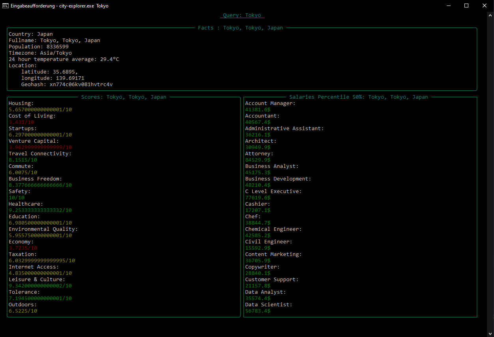

# City-Explorer

This programm uses the teleport.org api to give you an overview of the quality of live data of a city. It provides a terminal user interface aswell as a library of own ui implementations.

